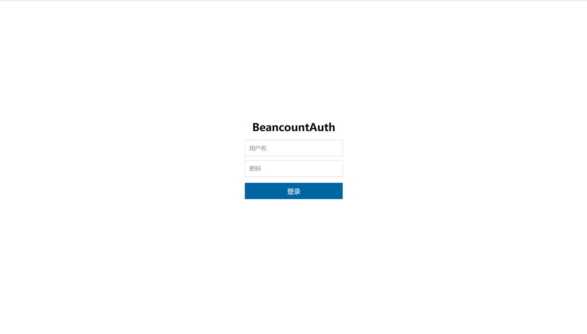
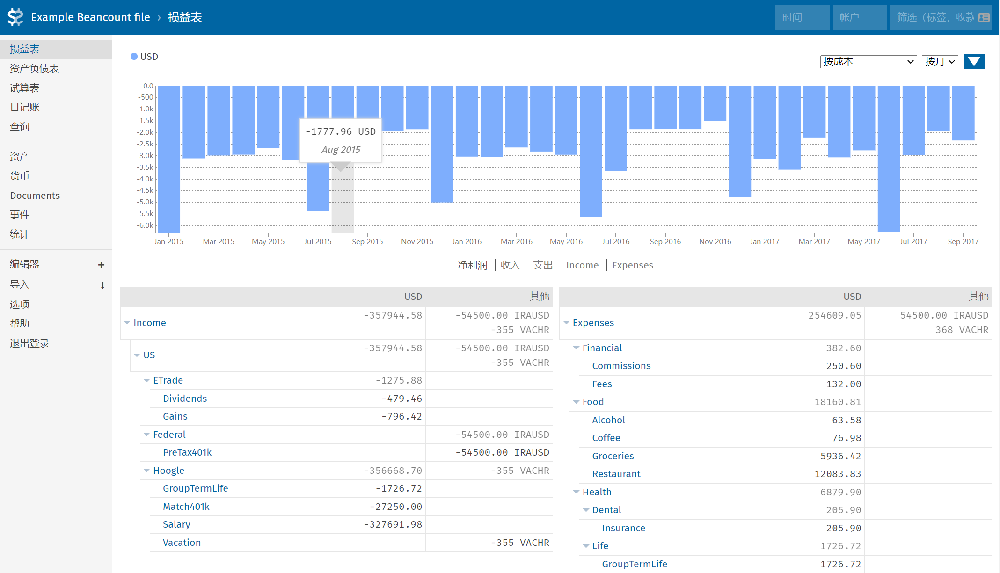

# beancount-auth

beancount-auth 通过反向代理的方式为 Fava 提供了账号密码登录的功能，并且可以修改 Fava 返回的 HTML，注入一段 JavaScript代码，从而拓展 Fava 的功能。beancount-auth 默认添加了退出登录的选项。



<center>登录页面</center>

  

<center>Fava页面</center>  


## 安装
运行环境：node.js >= 8.x

```sh
git clone https://github.com/tyanbiao/beancount-auth.git
cd beancount-auth
npm install
```

## 使用
1. 启动 fava 时设置参数 prefix 和 host，启动后，fava 将运行在 http://127.0.0.1:5000/fava 

```sh
fava main.bean --host 127.0.0.1 --prefix /fava
```

2. 在 config.js 中设置你的登录用户名和登录密码，除了 ` /static/* ` 和 ` /login ` 以外的所有 url 都需要登录。

  ```JavaScript
  const beancount = {
    path: '/fava',                        // 启动fava时添加的前缀
    target: 'http://127.0.0.1:5000/fava', // fava 运行的 url
    injectEnabled: true,                  // 是否注入JavaScript
    injectContent: '\n<script src="/static/inject.js"></script>', // 注入的内容
  }

  const application = {
    username: 'root', // 设置用户名
    password: 'root', // 设置登录密码
    host: '127.0.0.1',
    port: 3000,
  }
  ```

3. 启动

```sh
npm start
```

## 扩展
beancount-auth 默认会将 `/src/static/inject.js` 注入到 Fava 的 HTML，如果你需要扩展 Fava 的 UI，只要在这个文件里加入你的逻辑即可。
